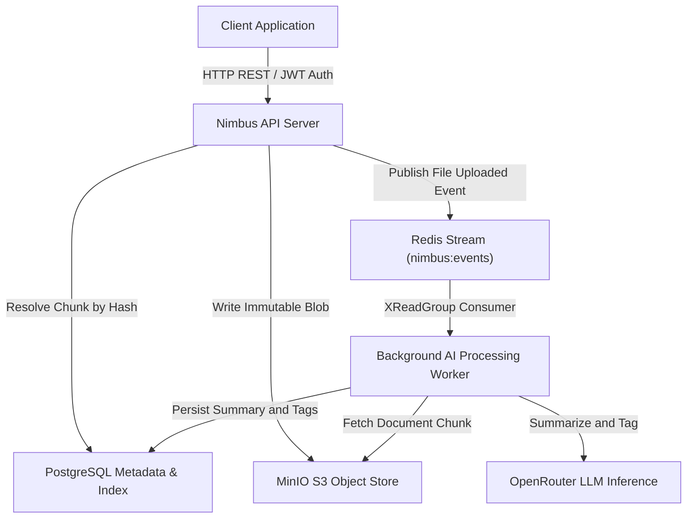
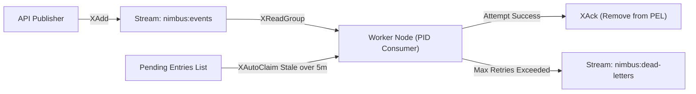

# Nimbus Distributed Cloud Storage Platform

[](https://github.com/adoniasketema/distributed-cloud-system/actions/workflows/ci.yml)

A cloud-native distributed file storage and retrieval system written in Go. Nimbus implements Content-Addressable Storage (CAS) for block-level deduplication, request correlation tracing across service boundaries, and an event-driven background worker that enriches uploaded files with LLM-generated summaries and keyword tags.

---

## Architectural Overview

Nimbus decouples synchronous API traffic from heavy computational processing and physical object management. The architecture relies on three primary persistence mechanisms:
1. **Relational Metadata Store (PostgreSQL)**: Maintains user directories, file path hierarchies, cryptographic chunk indexes, and GIN-indexed file metadata.
2. **Immutable Object Storage (MinIO S3)**: Houses raw, content-addressable binary blobs stored by their SHA-256 digests.
3. **Event Streaming & Job Orchestration (Redis Streams)**: Manages fault-tolerant background consumer groups that run file enrichment off the request path, and backs the cross-replica rate limiter.



---

## Core Systems Innovations

### 1. Content-Addressable Storage (CAS) Deduplication
To eliminate redundant storage overhead across users, files uploaded to Nimbus are processed through a deduplication engine:
- **Hash-Driven Addressability**: Streams are evaluated using SHA-256 digests. The computed hash serves as the storage primary key in MinIO.
- **Atomic Deduplication**: Before transferring bytes over the network, the engine resolves the chunk row for that hash in a single `INSERT ... ON CONFLICT DO NOTHING`, which reports whether the chunk is new. An existing chunk is linked to the new file without re-uploading the blob.
- **Orphan-Scan Garbage Collection**: References are the `file_chunks` rows themselves rather than a counter, so deleting a file simply removes its links. A background sweep finds chunks that no `file_chunks` row points at and that are older than 24 hours, and deletes them from MinIO and the database.
- **Collection is serialized against uploads**: each chunk is collected inside a transaction that locks the row, deletes the object, then deletes the row. An upload that wants the same hash blocks on that lock and, finding the row gone, re-uploads instead of adopting a chunk whose object was just removed. Uploads take a shared lock so they never block each other.

### 2. Event-Driven File Enrichment & DLQ Architecture
Summarization and keyword tagging run asynchronously so the upload response does not wait on model inference. Enrichment produces a JSON summary and tag list per file, which search matches against; it is not a vector embedding, and search is keyword matching rather than similarity ranking:
- **At-Least-Once Delivery**: The API server emits a structured `file_uploaded` event to a Redis Stream (`nimbus:events`).
- **Consumer Group Scalability**: Worker nodes connect via independent worker identities (`nimbus-workers` group). If a worker process exits prematurely during inference, pending messages remain unacknowledged in the Pending Entries List (PEL).
- **Automated Recovery & Dead-Letter Queue (DLQ)**: A recovery routine (`XAutoClaim`) sweeps stale PEL entries (pending > 5 minutes) and reassesses them. If processing fails after 3 exponential backoff retry cycles, the message is acknowledged on the main channel and routed to a Dead-Letter Stream (`nimbus:dead-letters`) for inspection and playback.
- **Text only**: files whose stored content type is not textual are skipped rather than being sent to the model as decoded bytes.



### 3. Distributed Tracing & Observability
System logs are structured for automated aggregation and debugging in distributed microservice architectures:
- **Structured JSON Logs (`log/slog`)**: All diagnostic output across API handlers, storage operations, database pool events, and background workers is formatted in machine-readable JSON schemas.
- **Correlation Propagation (`X-Request-ID`)**: Every incoming HTTP request is assigned a unique 16-character hexadecimal correlation identifier (extracted from client headers or generated via cryptographic entropy).
- **Cross-Boundary Trace Injection**: Correlation IDs are bound to runtime `context.Context`, injected into Redis Stream payload dictionaries, and rehydrated within background worker contexts. An engineer investigating an AI inference fault in the worker logs can immediately pivot to the exact HTTP POST request that originated the upload.

### 4. Defensive Engineering & Production Resilience
- **Strict I/O Bounding**: Protection against DoS and memory exhaustions via explicit HTTP server timeouts (`ReadTimeout`: 15s, `WriteTimeout`: 60s, `IdleTimeout`: 120s), strict streaming upload body limits (`http.MaxBytesReader` capped at 100MB), and bounded LLM response streaming (`io.LimitReader` capped at 1MB).
- **Cross-Replica Rate Limiting**: Fixed-window counters live in Redis, so the limit holds across every API instance rather than being multiplied by the replica count. `INCR` and `PEXPIRE` are applied in one Lua script so a counter can never be left without an expiry. If Redis is unreachable the limiter degrades to a per-process counter rather than failing open. Client identity is resolved through explicitly configured trusted proxy CIDRs, so `X-Forwarded-For` is only believed when it actually came from a known proxy.
- **Bounded Goroutine Lifetimes**: Background loops (rate limiter cleanup, stale stream reclaiming, garbage collection) select on `ctx.Done()`, so they exit on shutdown rather than outliving the process teardown.
- **Deep Readiness Probes (`GET /health/ready`)**: Separates liveness from operational readiness. The ready probe checks PostgreSQL, Redis, and MinIO under a shared 3-second deadline and returns per-dependency status (`503 Service Unavailable` when degraded). It reports which dependency is unhealthy, never the driver error text, so the probe cannot leak connection strings or internal hostnames.
- **Fail-Closed Configuration**: The API refuses to start without a `JWT_SECRET` of at least 32 characters that is not one of the placeholders in this repository, rather than falling back to a default signing key.

---

## Technology Stack

| Component | Technology | Rationale |
| :--- | :--- | :--- |
| **Core Runtime** | Go (see `go.mod`) | High-concurrency I/O performance, compile-time type safety, and low-footprint binary builds. |
| **HTTP Routing** | Standard Library (`net/http`) | Utilizes Go 1.22 pattern matching (`r.PathValue`) without external web router dependency bloating. |
| **Relational Store** | PostgreSQL 15 (`jackc/pgx/v5`) | Connection pooling, row-level locking for the deduplication/GC handshake, and GIN + trigram indexing for keyword search. |
| **Object Storage** | MinIO (`minio-go/v7`) | High-performance, Amazon S3-compatible cloud object storage streaming. |
| **Message Broker** | Redis Streams 7 (`redis/go-redis/v9`) | Durable log-based streaming processing with native consumer group replication and acknowledgment semantics. |
| **AI Integration** | OpenRouter (model configurable via `OPENROUTER_MODEL`) | Single JSON-mode chat completion per file, returning a one-line summary and 3-5 keyword tags. |

---

## Operations & Quickstart Reference

### Prerequisites
- **Go**: the version declared in `go.mod`
- **Docker & Docker Compose**: installed and running for local infrastructure orchestration

### Configuration
Copy the example environment file and fill it in:
```bash
cp .env.example .env
```

`JWT_SECRET` is **required** and has no default; the API will not start without it. Generate one with:
```bash
openssl rand -base64 48
```

File enrichment additionally needs `OPEN_ROUTER_API_KEY` and `OPENROUTER_MODEL` (any model id available on your OpenRouter account). Without them uploads still work; only enrichment is skipped.

### Makefile Command Summary
The project root contains a standardized operational Makefile:

```bash
# Spin up local PostgreSQL, MinIO Object Storage, and Redis broker
make dev-up

# Verify live infrastructure connectivity across all downstream services
make check-infra

# Apply database migrations (required before first run)
make migrate

# Run the unit test suite
make test

# Launch automated end-to-end integration test suite (builds services, tests deduplication, DLQ, and searching)
make e2e

# Compile the API, worker, and infra-check binaries into ./bin/
make build

# Stop and clean up Docker background infrastructure
make dev-down
```

### Running Local Integration Verification
To evaluate system correctness from end to end, execute:
```bash
make dev-up
make migrate
make e2e
```
This starts live API and worker processes, then exercises user registration and JWT authentication, folder hierarchy creation, a multi-chunk upload to verify CAS deduplication, byte-for-byte download integrity, asynchronous enrichment, keyword search, and graceful shutdown.

---

## Continuous Integration

Every push and pull request runs `gofmt`, `go vet`, the test suite under `-race`, a `govulncheck` scan, and `make build`. CI also asserts that no Go source file on disk is untracked or excluded by `.gitignore`, so a package cannot silently go missing from a fresh clone.

---

## Known Limitations

Honest scope boundaries rather than hidden defects:

- **Fixed-size chunking.** Chunks are fixed 4MB boundaries, so inserting bytes near the start of a file shifts every subsequent boundary and deduplication drops to zero for that file. Content-defined chunking (FastCDC or a rolling hash) is the standard fix and is not implemented.
- **Keyword search, not semantic search.** Search matches file names, summaries, and tags by substring and JSONB containment. There is no vector index and no similarity ranking.
- **No pagination.** Directory listings are unbounded; search is capped at 200 results.
- **No token revocation.** Access tokens are valid for 24 hours with no refresh or logout endpoint.
- **Storage is reclaimed on a delay.** Deleting a file removes its links immediately, but the underlying chunks are freed by a sweep that runs every 6 hours and only collects chunks unreferenced for 24 hours.

---

## License & Contributing

Licensed under the MIT License. Contributions must maintain structured logging, pass the full test suite, and avoid adding external HTTP routing dependencies.
