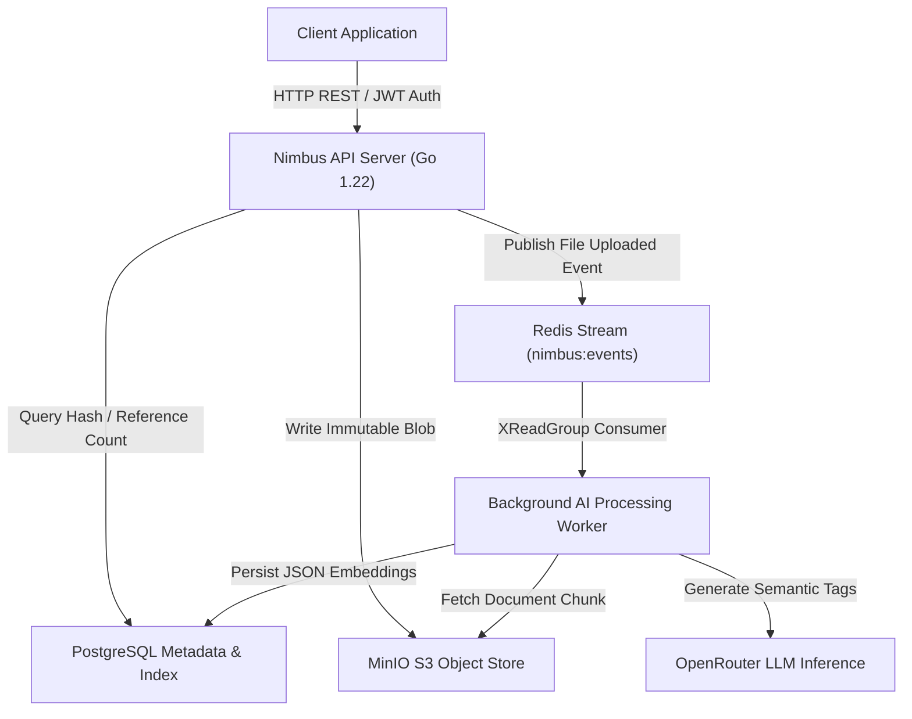

# Nimbus Distributed Cloud Storage Platform

A resilient, cloud-native distributed file storage and retrieval system written in Go. Nimbus implements Content-Addressable Storage (CAS) for block-level data deduplication, distributed correlation tracing, and an event-driven background processing engine for automated AI semantic indexing.

---

## Architectural Overview

Nimbus decouples synchronous API traffic from heavy computational processing and physical object management. The architecture relies on three primary persistence mechanisms:
1. **Relational Metadata Store (PostgreSQL)**: Maintains user directories, file path hierarchies, cryptographic chunk indexes, and GIN-indexed AI metadata tables.
2. **Immutable Object Storage (MinIO S3)**: Houses raw, content-addressable binary blobs stored by their SHA-256 digests.
3. **Event Streaming & Job Orchestration (Redis Streams)**: Manages fault-tolerant background consumer groups that execute semantic chunk extraction without degrading user API latency.



---

## Core Systems Innovations

### 1. Content-Addressable Storage (CAS) Deduplication
To eliminate redundant storage overhead across users, files uploaded to Nimbus are processed through a deduplication engine:
- **Hash-Driven Addressability**: Streams are evaluated using SHA-256 digests. The computed hash serves as the storage primary key in MinIO.
- **Reference Counting & Atomicity**: Before transferring physical bytes over the network, the engine queries PostgreSQL for existing chunks matching the hash. If a match is discovered, the storage reference counter is atomically incremented without writing duplicate blobs to S3.
- **Tombstone Garbage Collection**: File deletion decrements the reference count. A background cleanup scheduler scans for orphaned blobs (reference count of 0 for older than 24 hours) and issues physical deletion commands to MinIO, preventing race conditions with concurrent upload operations.

### 2. Event-Driven AI Semantic Indexing & DLQ Architecture
Document processing (summarization and keyword tagging) is scheduled asynchronously to maintain sub-10ms API return response times:
- **At-Least-Once Delivery**: The API server emits a structured `file_uploaded` event to a Redis Stream (`nimbus:events`).
- **Consumer Group Scalability**: Worker nodes connect via independent worker identities (`nimbus-workers` group). If a worker process exits prematurely during inference, pending messages remain unacknowledged in the Pending Entries List (PEL).
- **Automated Recovery & Dead-Letter Queue (DLQ)**: A recovery routine (`XAutoClaim`) sweeps stale PEL entries (pending > 5 minutes) and reassesses them. If processing fails after 3 exponential backoff retry cycles, the message is acknowledged on the main channel and routed to a Dead-Letter Stream (`nimbus:dead-letters`) for inspection and playback.

```mermaid
graph LR
    API["API Publisher"] -->|XAdd| MainStream["Stream: nimbus:events"]
    MainStream -->|XReadGroup| Worker["Worker Node (PID Consumer)"]
    Worker -->|Attempt Success| ACK["XAck (Remove from PEL)"]
    Worker -->|Max Retries Exceeded| DLQ["Stream: nimbus:dead-letters"]
    PEL["Pending Entries List"] -->|XAutoClaim (Stale > 5m)| Worker
```

### 3. Distributed Tracing & Observability
System logs are structured for automated aggregation and debugging in distributed microservice architectures:
- **Structured JSON Logs (`log/slog`)**: All diagnostic output across API handlers, storage operations, database pool events, and background workers is formatted in machine-readable JSON schemas.
- **Correlation Propagation (`X-Request-ID`)**: Every incoming HTTP request is assigned a unique 16-character hexadecimal correlation identifier (extracted from client headers or generated via cryptographic entropy).
- **Cross-Boundary Trace Injection**: Correlation IDs are bound to runtime `context.Context`, injected into Redis Stream payload dictionaries, and rehydrated within background worker contexts. An engineer investigating an AI inference fault in the worker logs can immediately pivot to the exact HTTP POST request that originated the upload.

### 4. Defensive Engineering & Production Resilience
- **Strict I/O Bounding**: Protection against DoS and memory exhaustions via explicit HTTP server timeouts (`ReadTimeout`: 15s, `WriteTimeout`: 60s, `IdleTimeout`: 120s), strict streaming upload body limits (`http.MaxBytesReader` capped at 100MB), and bounded LLM response streaming (`io.LimitReader` capped at 1MB).
- **Goroutine Leak Protection**: Concurrency middlewares (IP leaky-bucket rate limiting and stale stream reclaiming) utilize context-aware shutdown signal monitoring (`ctx.Done()` over explicit tickers), guaranteeing clean container teardown without memory leaks.
- **Deep Readiness Probes (`GET /health/ready`)**: Separates liveness from operational readiness. The ready probe performs parallel connectivity checks against PostgreSQL, Redis, and MinIO under a strict 3-second deadline, returning structured component health metrics (`503 Service Unavailable` during degraded downstream states).

---

## Technology Stack

| Component | Technology | Rationale |
| :--- | :--- | :--- |
| **Core Runtime** | Go 1.22 | High-concurrency I/O performance, compile-time type safety, and low-footprint binary builds. |
| **HTTP Routing** | Standard Library (`net/http`) | Utilizes Go 1.22 pattern matching (`r.PathValue`) without external web router dependency bloating. |
| **Relational Store** | PostgreSQL 15 (`jackc/pgx/v5`) | Advanced concurrency connection pool management and robust JSON GIN indexing for keyword searching. |
| **Object Storage** | MinIO (`minio-go/v7`) | High-performance, Amazon S3-compatible cloud object storage streaming. |
| **Message Broker** | Redis Streams 7 (`redis/go-redis/v9`) | Durable log-based streaming processing with native consumer group replication and acknowledgment semantics. |
| **AI Integration** | OpenRouter (Gemma 4 / Llama-3) | Standardized JSON inference abstraction for semantic document tags and executive summarization. |

---

## Operations & Quickstart Reference

### Prerequisites
- **Go**: Version 1.22 or higher
- **Docker & Docker Compose**: Installed and running for local infrastructure orchestration

### Makefile Command Summary
The project root contains a standardized operational Makefile:

```bash
# Spin up local PostgreSQL, MinIO Object Storage, and Redis broker
make dev-up

# Verify live infrastructure connectivity across all downstream services
make check-infra

# Execute deterministic single-threaded unit test verification suite
make test

# Launch automated end-to-end integration test suite (builds services, tests deduplication, DLQ, and searching)
make e2e

# Compile standalone static production Linux binaries into ./bin/
make build

# Stop and clean up Docker background infrastructure
make dev-down
```

### Running Local Integration Verification
To evaluate system correctness from end to end, execute:
```bash
make dev-up
make e2e
```
This routine initiates live API and background worker processes, exercises user registration and JWT authentication, constructs test folder hierarchies, streams a 5MB payload to verify CAS deduplication, asserts byte-for-byte stream extraction integrity, awaits asynchronous AI indexing completion, executes semantic searching, and verifies zero-leak graceful process shutdown.

---

## License & Contributing

Licensed under the MIT License. Contributions must maintain standardized structured logging formatting, complete unit test validation, and zero external framework routing dependencies.
